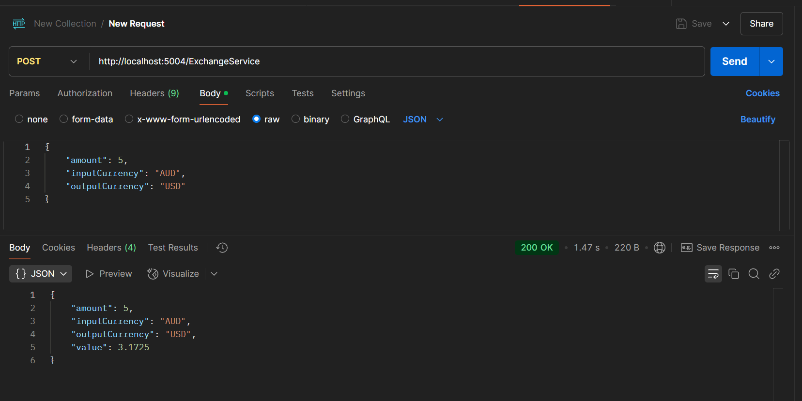

# Coding Challenge - Exchange Service API

## configuration

register for a api key at: https://www.exchangerate-api.com/

obtain key from: https://app.exchangerate-api.com/dashboard/confirmed

in appSettings.json or appSettingsDevelopment.json or environment variables when hosted add:

```json
	...
	"ExchangeRateApiHost": "https://v6.exchangerate-api.com/v6/",
  	"ExchangeRateApiKey": "APIKEY"
  	...
```

## running the api

you can run the api via your IDE in visual studio or rider by pressing the play button at the top right.

## running in postman

download postman from: https://www.postman.com/downloads/

import collection.json



you should see enpoint

POST `http://localhost:5004/ExchangeService`

the port may vary based on what IDE and configuration you are launching the API from.

with request body:

```json
{
    "amount": 5,
    "inputCurrency": "AUD",
    "outputCurrency": "USD"
}
```

and when ran, the response body should look like:

```json
{
    "amount": 5,
    "inputCurrency": "AUD",
    "outputCurrency": "USD",
    "value": 3.1725
}
```

## running tests

you can run all tests in the CodingChallenge.API.Tests from your IDE.

alternatively, you can run them on the cli within the directory of the tests project with the command `dotnet test`